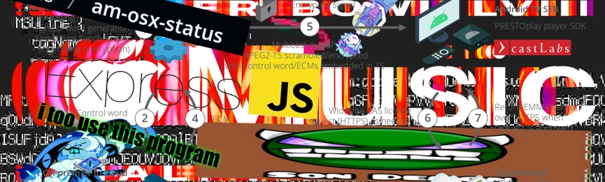
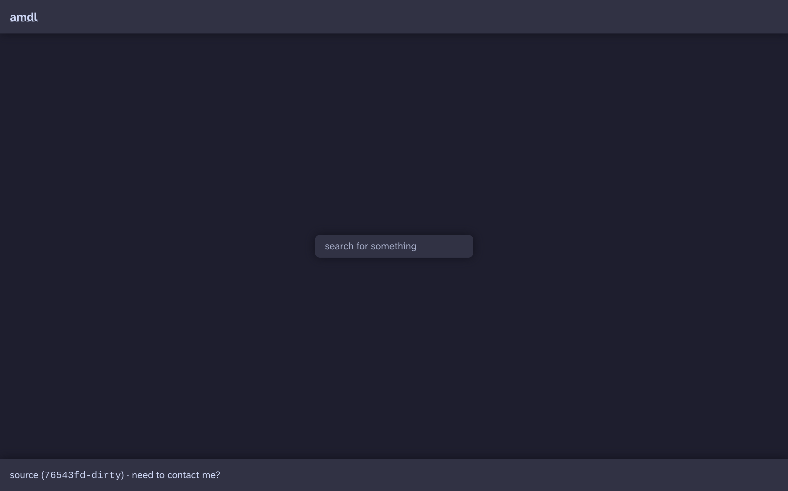
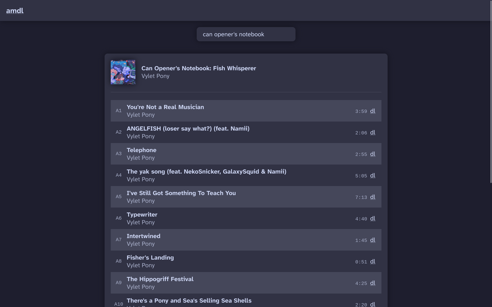
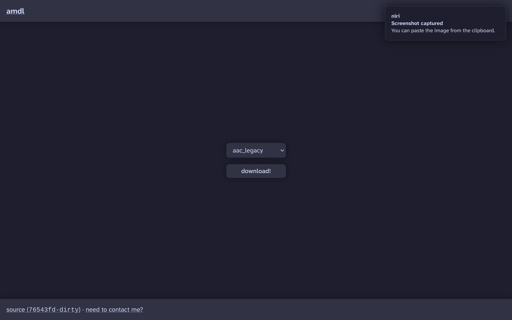

# amdl

a self-hostable web-ui apple music downloader widevine decryptor with questionable legality

thank you to [gamdl](https://github.com/glomatico/gamdl) for inspiring this project. i don't like python and i wanted a web front end

## setup

### `.env`

`MEDIA_USER_TOKEN` and `ITUA` are both from your apple music cookies

`WIDEVINE_CLIENT_ID` is uhm owie. this thing kind of Sucks to obtain and i would totally recommend finding a not-so-legal spot you can obtain this from (in fact, i found one on github LOL), rather than extracting it yourself. if you want to do through the pain like i did, check [this guide](https://forum.videohelp.com/threads/408031-Dumping-Your-own-L3-CDM-with-Android-Studio) out!! once you have your `client_id.bin` file, convert it to base64 and slap it in the env var (`cat client_id.bin | base64 -w 0`)

`WIDEVINE_PRIVATE_KEY` is essentially the same process of obtainment, you'll get it from the same guide!! i'm not sure how to easily find one of these on the web, but i'm sure you end users (user count: 0 () can pull through. this is also in base64 (`cat private_key.pem | base64 -w 0`)

`PUBLIC_DIR` and `VIEWS_DIR` should typically not need to be set by the user if using this repository as the working directory. blank values will result in simply `views` and `public` being grabbed from the cwd, which also so happens to be the default in [`.env.example`](./.env.example). set this manually to your own value if you get full runtime errors when accessing pages relating to templates being missing, assets having unexpected 404 issues, etc. this value is also recommended for packagers, to prevent the users having to copy over views and public--see how the nix build works!

### config

most of the config is talked on in [`config.example.toml`](./config.example.toml), just copy it over to `config.toml` and go wild! if you don't it will automatically be copied over on your first run. (at least if you're in the same directory as the repository) i tried to make the error reporting for invalid configurations pretty good and digestable

### running

just as easy as running `npm run build` and running the `dist/index.js` file with your javascript engine of choice

alternatively, use the nix flake, which has the proper `mainProgram` and default package attributes to make it easy. a nixos module is on its way!! don't fret

## limitations / the formats

currently you can only get basic widevine ones, everything related to playready and fairplay encryption methods are not supported, sorry!! someday i will get this working, at least for playready. it's just that no one has written a library yet but has for python (yuck!!)

guaranteed formats to work include:

- aac-legacy
- aac-he-legacy

## screenshots

screenshots

